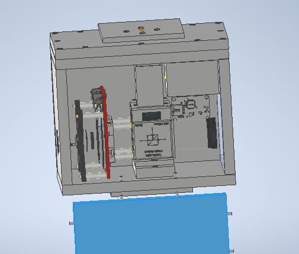

# Optical_box_final
# Modeled files
```
***Parts that are printed***
(Box)
left.ipt
right.ipt
front.ipt
back.ipt
top.ipt
topwindow.ipt
base.ipt
sidebracket.ipt

(Inside box)
pmtbase.ipt
pmtholder.ipt
baseplate.ipt
baseblock.ipt
tube.ipt

(Parts for Laser adapter box)
laserseal.ipt
laser_bolt_hexagonal.ipt
laser_bolt.ipt (Same as laser_bolt_hexagonal.ipt but circular, not as easy to tighten) 

***Parts that are not printed***
acrylicpmt.ipt
acrylicwindow.ipt
Assembly1.iam
gasket.ipt
toppmt.ipt(Monitor PMT)
```
Rest of the files are either .stl of modeled files or Thorlab's asset. </br>
<figure>
 
  <figcaption>Fig1 : Model of Optical Box</figcaption>
</figure>

